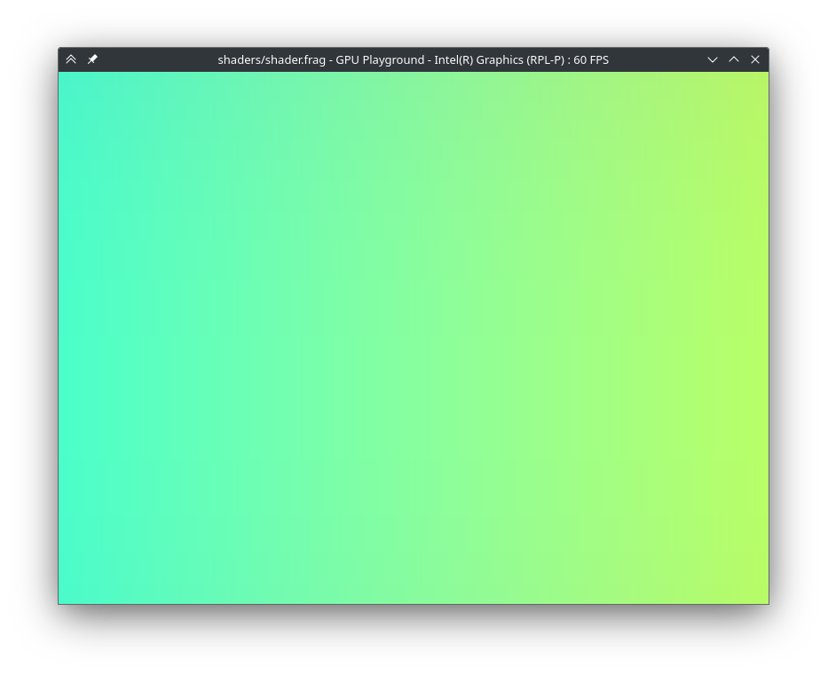

<div style="text-align: center">
    <h1>gpuplay - GPU shader playground</h1>
    
</div>

`gpuplay` is a cross-platform command line utility to create and visualize fragment shaders written in the [Shadertoy format](https://www.shadertoy.com/howto). It works across a multitude of display APIs including DirectX, Metal, Vulkan and OpenGL thanks to its reliance on the `wgpu` graphics abstraction.

### Features
- Works on all major platforms using all the graphics APIs supported by `wgpu`
- Supports viewing [WGSL](https://gpuweb.github.io/gpuweb/wgsl/) and [GLSL](https://github.com/KhronosGroup/glslang) fragment shaders
- Hot reload: changes to the shaders will be applied without restarting the application
- Gallery view: load multiple shaders at once and switch between them with keyboard controls

### Build from source
To get started hacking on this project, ensure you have [the Rust toolchain](https://www.rust-lang.org/tools/install) installed on your machine. Clone this repository using `git`, then build and run the application using the shader examples:
```sh
cargo run -- shaders/*.frag
```

### License
Licensed under the Apache 2.0 or MIT License, at your option.
